# ReccoMe

## Overview

ReccoMe is a mobile app for tracking and reviewing food places you've visited directly on an interactive map.

I built it as a portfolio project to challenge myself with full-stack mobile development. The inspiration came from a simple personal problem: I wanted a sleek, visual way to see exactly what food spots I loved at a single glance on a map.


## Tech Stack

| Layer | Tech 
|-------|------
| **Frontend** | React Native (Expo) 
| **State Management** | Zustand + React Query 
| **Secure Storage** | expo-secure-store 
| **Backend** | Express.js + Node.js 
| **Database** | PostgreSQL 
| **Auth** | JWT (access + refresh) 
| **Image Storage** | Cloudinary 
| **Location Search** | Mapbox |

## Key Features

- **Interactive Map View** — See all your reviewed restaurants pinned on a live map, color-coded by average rating
- **Restaurant Search** — Search for restaurants powered by Mapbox; instant location suggestions as you type
- **Detailed Reviews** — Log visits with star ratings (food, atmosphere, value), meal type, amount spent, photos, and personal notes
- **Secure Authentication** — JWT-based login with automatic token refresh; tokens stored in encrypted device storage
- **Profile Management** — Update username/email or delete your account entirely

## Screenshots

### Sign Up / Login

| Sign Up | Login |
| --- | --- |
| 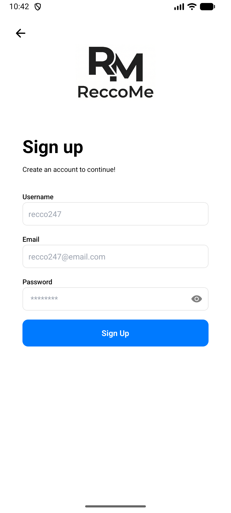 | 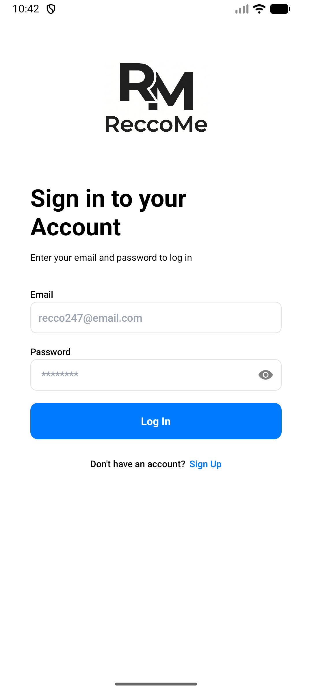 |

---

### Home Page - Map View

| Default Map View | Selected a Reviewed Location |
| --- | --- |
| 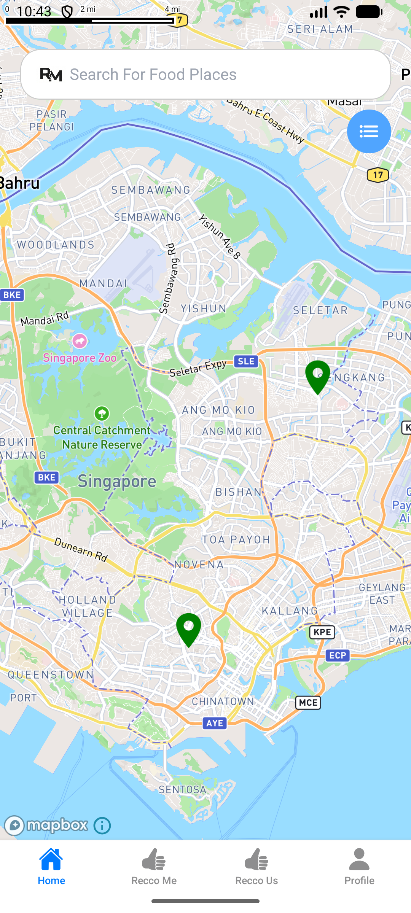 | 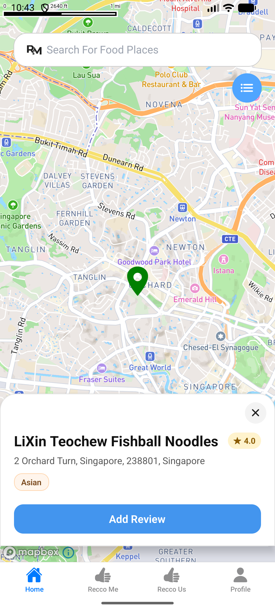 |

### Home Page - Search Flow

| Search Layout | Selected a Location |
| --- | --- |
| 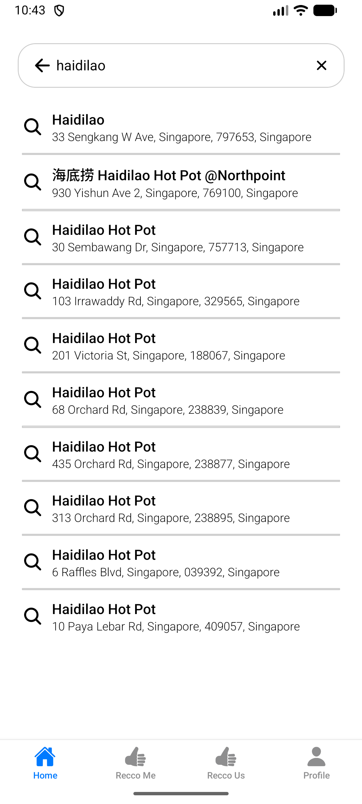 | 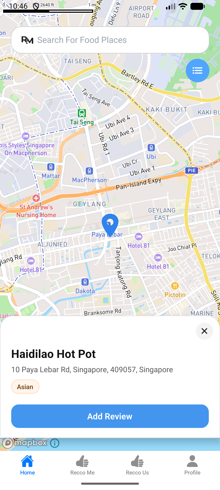 |

### Home Page - List View

<p align="center">
  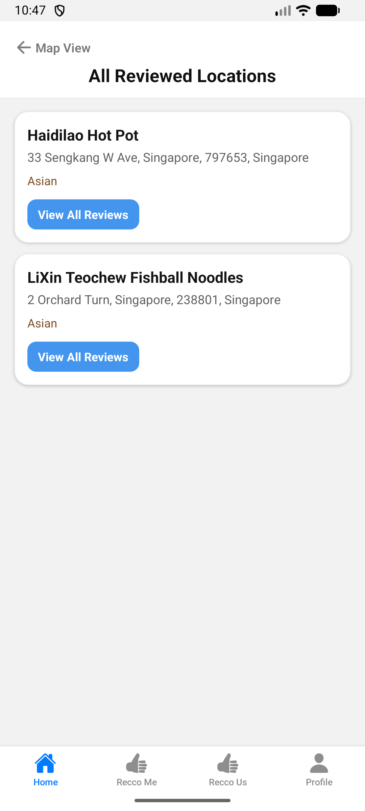
</p>

### View Reviews Page (for a specific location)

<p align="center">
  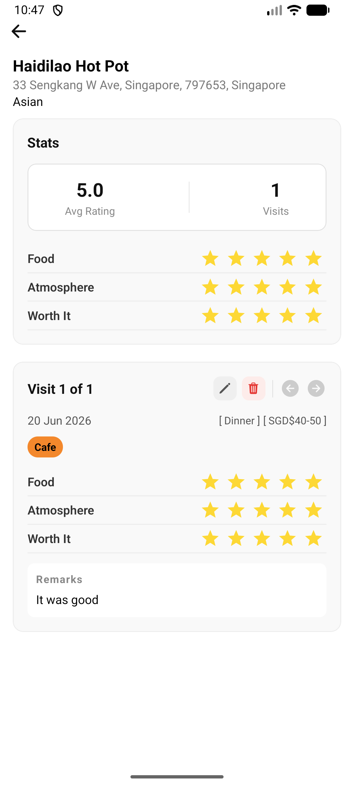
</p>

### Add / Edit Reviews Page

| Add / Edit Review 1 | Add / Edit Review 2 |
| --- | --- |
| 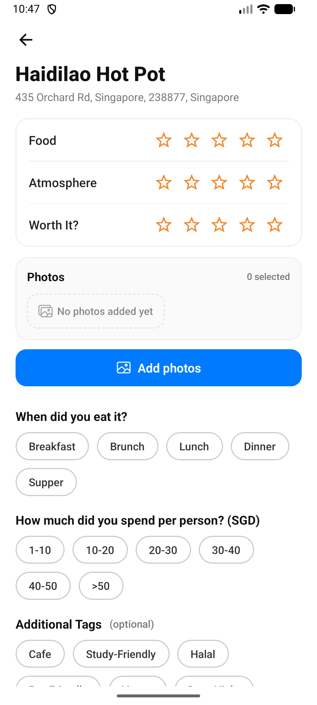 | 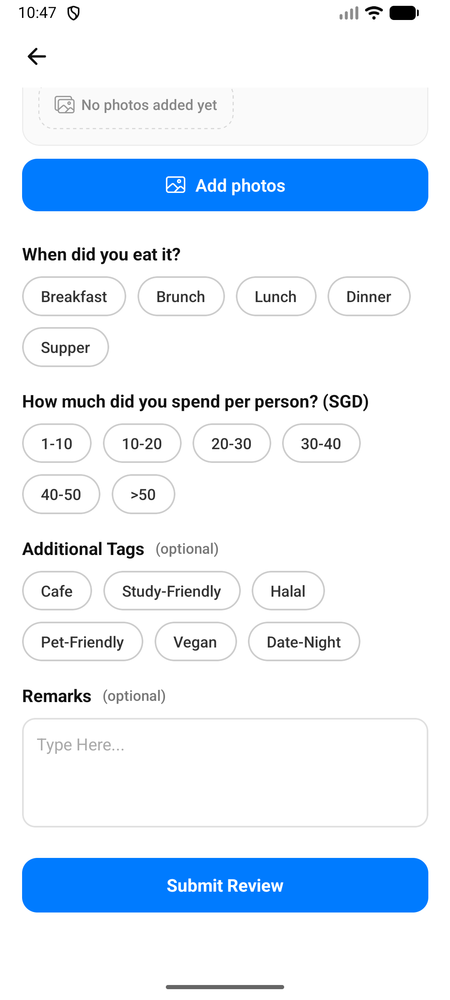 |

### Profile Page

| Profile Page | Edit Profile Page |
| --- | --- |
| 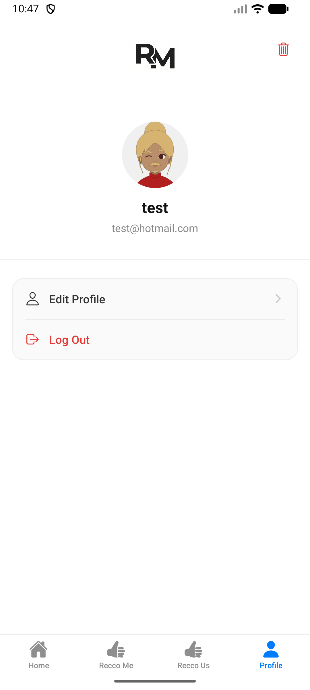 |  |


## Architecture

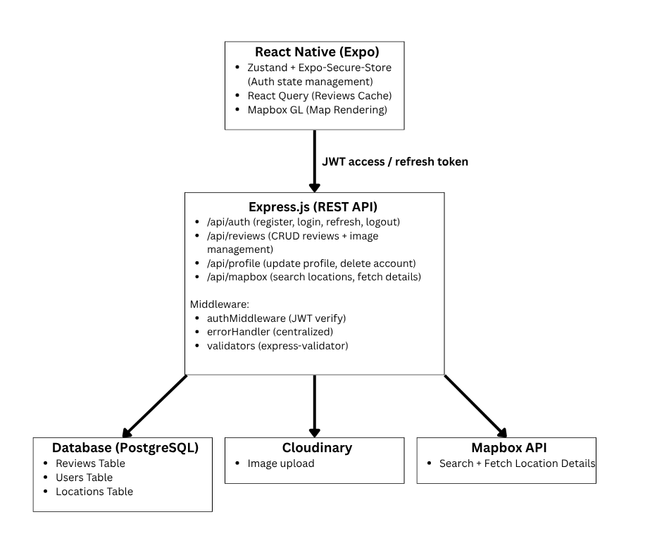

The React Native app communicates with the Express API over HTTPS and sends access tokens in the `Authorization: Bearer <token>` header for protected routes. On `401`, the frontend uses the refresh endpoint to rotate tokens and retry the request.

The backend acts as the single integration layer:
- PostgreSQL stores users, locations, and reviews
- Cloudinary stores images and returns `secure_url` values that are persisted in Postgres
- Mapbox powers restaurant search and location details (proxied through backend routes)


## Key Decisions
- **JWT refresh-token rotation**
    - Access tokens are short-lived for security, while refresh tokens allow seamless sessions. Refresh token rotation reduces reuse risk if an old token is compromised.

- **React Query for server state**
    - Reviews are shared across multiple screens, so React Query simplifies caching, invalidation, and refetch behavior compared to manually coordinating `useState + useEffect` flows.

- **Cloudinary for image storage**
    - Images are stored outside the database to avoid bloat and improve delivery performance. The backend stores only Cloudinary URLs in Postgres.

- **Zustand for auth state**
    - Zustand provides lightweight global state with less setup than React Context.

- **Parameterized SQL queries (`$1`, `$2`, ...)**
  - The backend uses positional parameters instead of string interpolation, so user input is bound safely and SQL injection risk is reduced.

- **Debounced Mapbox search requests (frontend)**
  - A debounce timer is applied while users type in Mapbox search, reducing rapid repeated calls so the backend is not spammed.

## Known Limitations
- Recommendation tabs are placeholders
  - `ReccoMe` and `ReccoUs` are currently stubs. A recommendation engine is planned for a future iteration.

- No rate limiting yet
  - Auth endpoints and third-party API routes do not currently enforce request throttling, which increases brute-force and abuse risk.

- No pagination on reviews
  - Review queries currently return all results for the authenticated user. Pagination is currently not necessary but might be needed for scalability

- Best-effort Cloudinary cleanup
  - Image deletion failures are logged, but there is no retry queue or dead-letter handling yet.

- No password reset flow

- No email verification or two-factor authentication

- Limited filtering and sorting
  - Filtering and sorting is not implementeed

- Cross-layer schema consistency is manual
  - Validation and data contracts are maintained separately across frontend and backend, which can lead to drift. A shared schema strategy is not yet implemented.

- iOS build is currently failing

## Setting Up
### Prerequisites (tbc)

- Node.js 18+
- npm 8+
- PostgreSQL 13+ (local or hosted)
- Android Studio (SDK + Emulator) for Android builds
- JDK 17
- Mapbox account (API token)
- Cloudinary account (cloud name, API key, API secret)

### Environment Variables

Create a `.env` file in `backend/`:

```env
JWT_SECRET=
JWT_REFRESH_SECRET=
MAPBOX_TOKEN=

PORT=

PGUSER=
PGHOST=
PGDATABASE=
PGPASSWORD=
PGPORT=

CLOUDINARY_CLOUD_NAME=
CLOUDINARY_API_KEY=
CLOUDINARY_API_SECRET=

```

Create a `.env` file in `frontend/`:

```env
EXPO_PUBLIC_API_BASE_URL=http://localhost:3000
EXPO_PUBLIC_MAPBOX_ACCESS_TOKEN=your_mapbox_public_token
```

### Install Dependencies

Backend:

```bash
cd backend
npm install
```

Frontend:

```bash
cd frontend
npm install
```

### Run Locally

Start backend:

```bash
cd backend
npm run dev
```

Start frontend on Android emulator/device:

```bash
cd frontend
npx expo run:android
```

## API Reference

Base URL (local): `http://localhost:3000`

> **Note:** Protected routes require an access token in the `Authorization: Bearer <access_token>` header.

### Quick Reference

| Method | Endpoint | Description |
| :--- | :--- | :--- |
| `POST` | `/api/auth/register` | Create user account |
| `POST` | `/api/auth/login` | Authenticate user |
| `POST` | `/api/auth/logout` | Logout user |
| `POST` | `/api/auth/refresh` | Rotate access token |
| `PATCH` | `/api/profile/` | Update profile |
| `DELETE` | `/api/profile/` | Delete profile |
| `POST` | `/api/reviews/` | Create review |
| `GET` | `/api/reviews/` | Get user reviews |
| `PATCH` | `/api/reviews/:id` | Update review |
| `DELETE` | `/api/reviews/:id` | Delete review |
| `GET` | `/api/mapbox/search/suggestions` | Search locations |
| `GET` | `/api/mapbox/search/:id` | Get location details |
---

### Detailed Endpoints

<details>
 <summary><code>POST</code> <code><b>/api/auth/register</b></code></summary>

##### Description
Creates a new user account and returns access and refresh token.

##### Authentication
None

##### Parameters

> | name | type | required | description |
> |---|---|---|---|
> | username | string | Yes | New username (must be unique) |
> | email | string | Yes | New email (must be unique, valid format) |
> | password | string | Yes | Raw password (hashed on backend) |

##### Responses

> | http code | content-type | response |
> |---|---|---|
> | `201` | `application/json` | User object with tokens |
> | `400` | `application/json` | Validation failed |
> | `500` | `application/json` | Server error |

##### Example (JavaScript fetch)

> ```javascript
> const response = await fetch('http://localhost:3000/api/auth/register', {
>   method: 'POST',
>   headers: {
>     'Content-Type': 'application/json'
>   },
>   body: JSON.stringify({
>     username: 'test',
>     email: 'test@example.com',
>     password: 'password123'
>   })
> });
>
> const data = await response.json();
> ```

##### Response

> ```json
> {
>   "success": true,
>   "data": {
>     "id": 1,
>     "username": "test",
>     "email": "test@example.com"
>   },
>   "accessToken": "<jwt_access_token>",
>   "refreshToken": "<jwt_refresh_token>"
> }
> ```

</details>

---

<details>
 <summary><code>POST</code> <code><b>/api/auth/login</b></code></summary>

##### Description
Authenticates a user and returns access and refresh token on successful login.

##### Authentication
None

##### Parameters

> | name | type | required | description |
> |---|---|---|---|
> | email | string | Yes | Registered email |
> | password | string | Yes | Account password |

##### Responses

> | http code | content-type | response |
> |---|---|---|
> | `200` | `application/json` | User object with tokens |
> | `400` | `application/json` | Validation failed |
> | `401` | `application/json` | Invalid email or password |
> | `500` | `application/json` | Server error |

##### Example (JavaScript fetch)

> ```javascript
> const response = await fetch('http://localhost:3000/api/auth/login', {
>   method: 'POST',
>   headers: {
>     'Content-Type': 'application/json'
>   },
>   body: JSON.stringify({
>     email: 'test@example.com',
>     password: 'password123'
>   })
> });
>
> const data = await response.json();
> ```

##### Response

> ```json
> {
>   "success": true,
>   "data": {
>     "id": 1,
>     "username": "test",
>     "email": "test@example.com"
>   },
>   "accessToken": "<jwt_access_token>",
>   "refreshToken": "<jwt_refresh_token>"
> }
> ```

</details>

---

<details>
 <summary><code>POST</code> <code><b>/api/auth/logout</b></code></summary>

##### Description
Logs out the current user by clearing stored refresh token in the database.

##### Authentication
Bearer Token required

##### Parameters
None

##### Responses

> | http code | content-type | response |
> |---|---|---|
> | `200` | `application/json` | Success |
> | `401` | `application/json` | Invalid or missing token |
> | `500` | `application/json` | Server error |

##### Example (JavaScript fetch)

> ```javascript
> const response = await fetch('http://localhost:3000/api/auth/logout', {
>   method: 'POST',
>   headers: {
>     Authorization: 'Bearer <access_token>'
>   }
> });
>
> const data = await response.json();
> ```

##### Response

> ```json
> {
>   "success": true
> }
> ```

</details>

---

<details>
 <summary><code>POST</code> <code><b>/api/auth/refresh</b></code></summary>

##### Description
Rotates refresh token and returns a new access token + refresh token pair.

##### Authentication
None

##### Parameters

> | name | type | required | description |
> |---|---|---|---|
> | refreshToken | string | Yes | Previously issued refresh token |

##### Responses

> | http code | content-type | response |
> |---|---|---|
> | `200` | `application/json` | New tokens |
> | `401` | `application/json` | Missing or Invalid refresh token |
> | `500` | `application/json` | Server error |

##### Example (JavaScript fetch)

> ```javascript
> const response = await fetch('http://localhost:3000/api/auth/refresh', {
>   method: 'POST',
>   headers: {
>     'Content-Type': 'application/json'
>   },
>   body: JSON.stringify({
>     refreshToken: '<jwt_refresh_token>'
>   })
> });
>
> const data = await response.json();
> ```

##### Response

> ```json
> {
>   "success": true,
>   "accessToken": "<new_jwt_access_token>",
>   "refreshToken": "<new_jwt_refresh_token>"
> }
> ```

</details>

---

<details>
 <summary><code>PATCH</code> <code><b>/api/profile/</b></code></summary>

##### Description
Updates current user's username and/or email.

##### Authentication
Bearer Token required

##### Parameters

> | name | type | required | description |
> |---|---|---|---|
> | username | string | No | New username (unique) |
> | email | string | No | New email (unique, valid format) |
>
> At least one field is required.

##### Responses

> | http code | content-type | response |
> |---|---|---|
> | `200` | `application/json` | Updated user object |
> | `400` | `application/json` | Validation failed or no fields |
> | `401` | `application/json` | Invalid or missing token |
> | `409` | `application/json` | Email or username taken |
> | `500` | `application/json` | Server error |

##### Example (JavaScript fetch)

> ```javascript
> const response = await fetch('http://localhost:3000/api/profile/', {
>   method: 'PATCH',
>   headers: {
>     Authorization: 'Bearer <access_token>',
>     'Content-Type': 'application/json'
>   },
>   body: JSON.stringify({
>     username: 'newname'
>   })
> });
>
> const data = await response.json();
> ```

##### Response

> ```json
> {
>   "success": true,
>   "data": {
>     "id": 1,
>     "username": "newname",
>     "email": "dean@example.com"
>   }
> }
> ```

</details>

---

<details>
 <summary><code>DELETE</code> <code><b>/api/profile/</b></code></summary>

##### Description
Deletes the current user account. Related reviews are cascaded; image cleanup in Cloudinary is best-effort async.

##### Authentication
Bearer Token required

##### Parameters
None

##### Responses

> | http code | content-type | response |
> |---|---|---|
> | `200` | `application/json` | Success |
> | `401` | `application/json` | Invalid or missing token |
> | `500` | `application/json` | Server error |

##### Example (JavaScript fetch)

> ```javascript
> const response = await fetch('http://localhost:3000/api/profile/', {
>   method: 'DELETE',
>   headers: {
>     Authorization: 'Bearer <access_token>'
>   }
> });
>
> const data = await response.json();
> ```

##### Response

> ```json
> {
>   "success": true
> }
> ```

</details>

---

<details>
 <summary><code>POST</code> <code><b>/api/reviews/</b></code></summary>

##### Description
Creates a review for a location. If location does not exist yet, it is upserted first.

##### Authentication
Bearer Token required

##### Parameters

> **Location Object (required)**
> | name | type | required | description |
> |---|---|---|---|
> | location.mapbox_id | string | Yes | Mapbox place identifier |
> | location.place_name | string | Yes | Place name |
> | location.address | string | Yes | Full address |
> | location.latitude | number | Yes | Latitude |
> | location.longitude | number | Yes | Longitude |
> | location.cuisine_types | string[] | No | Cuisine tags from Mapbox |
>
> **Review Object (required)**
> | name | type | required | description |
> |---|---|---|---|
> | review.food_rating | integer | Yes | 1-5 |
> | review.atmosphere_rating | integer | Yes | 1-5 |
> | review.worth_it_rating | integer | Yes | 1-5 |
> | review.meal_type | string | No | Breakfast, Brunch, Lunch, Dinner, Supper |
> | review.amount_spent | string | No | 1-10, 10-20, 20-30, 30-40, 40-50, >50 |
> | review.tags | string[] | No | Review tags |
> | review.remarks | string | No | Free text note |
> | review.image_urls | string[] | No | Base64 data URLs |

##### Responses

> | http code | content-type | response |
> |---|---|---|
> | `201` | `application/json` | Review object |
> | `400` | `application/json` | Validation failed |
> | `401` | `application/json` | Invalid or missing token |
> | `500` | `application/json` | Server error |

##### Example (JavaScript fetch)

> ```javascript
> const response = await fetch('http://localhost:3000/api/reviews/', {
>   method: 'POST',
>   headers: {
>     Authorization: 'Bearer <access_token>',
>     'Content-Type': 'application/json'
>   },
>   body: JSON.stringify({
>     location: {
>       mapbox_id: 'mbx.123',
>       place_name: 'Ippudo',
>       address: '123 Orchard Rd, Singapore',
>       latitude: 1.3012,
>       longitude: 103.8371,
>       cuisine_types: ['Japanese']
>     },
>     review: {
>       food_rating: 5,
>       atmosphere_rating: 4,
>       worth_it_rating: 4,
>       meal_type: 'Dinner',
>       amount_spent: '20-30',
>       tags: ['Cafe', 'Study-Friendly'],
>       remarks: 'Rich broth, long queue.',
>       image_urls: []
>     }
>   })
> });
>
> const data = await response.json();
> ```

##### Response

> ```json
> {
>   "success": true,
>   "data": {
>     "id": 7,
>     "user_id": 1,
>     "location_id": "mbx.123",
>     "food_rating": 5,
>     "atmosphere_rating": 4,
>     "worth_it_rating": 4,
>     "meal_type": "Dinner",
>     "amount_spent": "20-30",
>     "tags": ["ramen", "queue-worth"],
>     "remarks": "Rich broth, long queue.",
>     "image_urls": null,
>     "created_at": "2026-06-24T10:00:00.000Z",
>     "updated_at": "2026-06-24T10:00:00.000Z"
>   }
> }
> ```

</details>

---

<details>
 <summary><code>GET</code> <code><b>/api/reviews/</b></code></summary>

##### Description
Returns all reviews for the authenticated user, grouped by location.

##### Authentication
Bearer Token required

##### Parameters
None

##### Responses

> | http code | content-type | response |
> |---|---|---|
> | `200` | `application/json` | Array of locations with reviews |
> | `401` | `application/json` | Invalid or missing token |
> | `500` | `application/json` | Server error |

##### Example (JavaScript fetch)

> ```javascript
> const response = await fetch('http://localhost:3000/api/reviews/', {
>   method: 'GET',
>   headers: {
>     Authorization: 'Bearer <access_token>'
>   }
> });
>
> const data = await response.json();
> ```

##### Response

> ```json
> {
>   "success": true,
>   "data": [
>     {
>       "mapbox_id": "mbx.123",
>       "place_name": "Ippudo",
>       "address": "123 Orchard Rd, Singapore",
>       "latitude": 1.3012,
>       "longitude": 103.8371,
>       "cuisine_types": ["Japanese"],
>       "reviews": [
>         {
>           "id": 7,
>           "food_rating": 5,
>           "atmosphere_rating": 4,
>           "worth_it_rating": 4,
>           "meal_type": "Dinner",
>           "amount_spent": "20-30",
>           "tags": ["ramen"],
>           "remarks": "Great",
>           "image_urls": null,
>           "created_at": "2026-06-24T10:00:00.000Z",
>           "updated_at": "2026-06-24T10:00:00.000Z"
>         }
>       ]
>     }
>   ]
> }
> ```

</details>

---

<details>
 <summary><code>PATCH</code> <code><b>/api/reviews/:id</b></code></summary>

##### Description
Partially updates a review owned by the current user.

##### Authentication
Bearer Token required

##### Parameters

> **Path Parameter**
> | name | type | required | description |
> |---|---|---|---|
> | id | integer | Yes | Review ID |
>
> **Body Parameters** (at least one required)
> | name | type | description |
> |---|---|---|
> | food_rating | integer | 1-5 |
> | atmosphere_rating | integer | 1-5 |
> | worth_it_rating | integer | 1-5 |
> | meal_type | string \| null | Breakfast, Brunch, Lunch, Dinner, Supper |
> | amount_spent | string \| null | 1-10, 10-20, 20-30, 30-40, 40-50, >50 |
> | tags | string[] \| null | Tag list |
> | remarks | string \| null | Free text |
> | image_urls | string[] \| null | Mixed base64 and Cloudinary URLs |

##### Responses

> | http code | content-type | response |
> |---|---|---|
> | `200` | `application/json` | Updated review object |
> | `400` | `application/json` | Validation failed |
> | `401` | `application/json` | Invalid or missing token |
> | `403` | `application/json` | Can only update own reviews |
> | `404` | `application/json` | Review not found |
> | `500` | `application/json` | Server error |

##### Example (JavaScript fetch)

> ```javascript
> const response = await fetch('http://localhost:3000/api/reviews/7', {
>   method: 'PATCH',
>   headers: {
>     Authorization: 'Bearer <access_token>',
>     'Content-Type': 'application/json'
>   },
>   body: JSON.stringify({
>     food_rating: 4,
>     remarks: 'Still good, but soup was salty'
>   })
> });
>
> const data = await response.json();
> ```

##### Response

> ```json
> {
>   "success": true,
>   "data": {
>     "id": 7,
>     "user_id": 1,
>     "location_id": "mbx.123",
>     "food_rating": 4,
>     "atmosphere_rating": 4,
>     "worth_it_rating": 4,
>     "meal_type": "Dinner",
>     "amount_spent": "20-30",
>     "tags": ["ramen"],
>     "remarks": "Still good, but soup was salty",
>     "image_urls": null,
>     "created_at": "2026-06-24T10:00:00.000Z",
>     "updated_at": "2026-06-25T09:10:00.000Z"
>   }
> }
> ```

</details>

---

<details>
 <summary><code>DELETE</code> <code><b>/api/reviews/:id</b></code></summary>

##### Description
Deletes a review owned by the current user. Cloudinary image cleanup is best-effort async.

##### Authentication
Bearer Token required

##### Parameters

> **Path Parameter**
> | name | type | required | description |
> |---|---|---|---|
> | id | integer | Yes | Review ID |

##### Responses

> | http code | content-type | response |
> |---|---|---|
> | `200` | `application/json` | Success |
> | `401` | `application/json` | Invalid or missing token |
> | `403` | `application/json` | Can only delete own reviews |
> | `404` | `application/json` | Review not found |
> | `500` | `application/json` | Server error |

##### Example (JavaScript fetch)

> ```javascript
> const response = await fetch('http://localhost:3000/api/reviews/7', {
>   method: 'DELETE',
>   headers: {
>     Authorization: 'Bearer <access_token>'
>   }
> });
>
> const data = await response.json();
> ```

##### Response

> ```json
> {
>   "success": true,
>   "data": null
> }
> ```

</details>

---

<details>
 <summary><code>GET</code> <code><b>/api/mapbox/search/suggestions</b></code></summary>

##### Description
Proxy endpoint to Mapbox Search Box suggest API for POI suggestions.

##### Authentication
Bearer Token required

##### Parameters

> **Query Parameters**
> | name | type | required | description |
> |---|---|---|---|
> | query | string | Yes | Search keyword |
> | session_token | string | Yes | Client-generated session token |

##### Responses

> | http code | content-type | response |
> |---|---|---|
> | `200` | `application/json` | Suggestions array |
> | `400` | `application/json` | Missing query or session_token |
> | `401` | `application/json` | Invalid or missing token |
> | `500` | `application/json` | Server error |

##### Example (JavaScript fetch)

> ```javascript
> const params = new URLSearchParams({
>   query: 'ramen',
>   session_token: 'abc123'
> });
>
> const response = await fetch(`http://localhost:3000/api/mapbox/search/suggestions?${params.toString()}`, {
>   method: 'GET',
>   headers: {
>     Authorization: 'Bearer <access_token>'
>   }
> });
>
> const data = await response.json();
> ```

##### Response

> ```json
> {
>   "success": true,
>   "data": [
>     {
>       "mapbox_id": "dXJuOm1ieHBvaTo...",
>       "name": "Ippudo",
>       "address": "Orchard Road, Singapore"
>     }
>   ]
> }
> ```

</details>

---

<details>
 <summary><code>GET</code> <code><b>/api/mapbox/search/:id</b></code></summary>

##### Description
Fetches a selected place detail from Mapbox and normalizes fields.

##### Authentication
Bearer Token required

##### Parameters

> **Path Parameter**
> | name | type | required | description |
> |---|---|---|---|
> | id | string | Yes | Mapbox place ID |
>
> **Query Parameter**
> | name | type | required | description |
> |---|---|---|---|
> | session_token | string | Yes | Same session token from suggestions endpoint|

##### Responses

> | http code | content-type | response |
> |---|---|---|
> | `200` | `application/json` | Location details object |
> | `400` | `application/json` | Missing id or session_token |
> | `401` | `application/json` | Invalid or missing token |
> | `404` | `application/json` | Location not found on Mapbox |
> | `500` | `application/json` | Server error |

##### Example (JavaScript fetch)

> ```javascript
> const params = new URLSearchParams({
>   session_token: 'abc123'
> });
>
> const response = await fetch(`http://localhost:3000/api/mapbox/search/dXJuOm1ieHBvaTo...?${params.toString()}`, {
>   method: 'GET',
>   headers: {
>     Authorization: 'Bearer <access_token>'
>   }
> });
>
> const data = await response.json();
> ```

##### Response

> ```json
> {
>   "success": true,
>   "data": {
>     "mapbox_id": "dXJuOm1ieHBvaTo...",
>     "name": "Ippudo",
>     "address": "123 Orchard Rd, Singapore",
>     "latitude": 1.3012,
>     "longitude": 103.8371,
>     "cuisine_types": ["Japanese"]
>   }
> }
> ```

</details>

---

### Error Response Format

All endpoints use a shared error response structure:

<details>
 <summary>Error Response Format</summary>

##### Validation Error

> ```json
> {
>   "success": false,
>   "message": "Validation failed",
>   "errors": [
>     { "field": "email", "message": "Email format is invalid" }
>   ]
> }
> ```

##### Server Error

> ```json
> {
>   "success": false,
>   "message": "Internal Server Error"
> }
> ```

</details>


